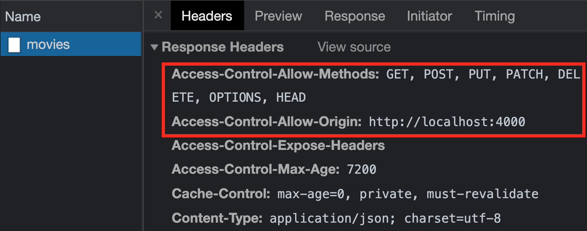

# Cross-Origin Resource Sharing (CORS)

## Learning Goals

- Understand Cross-Origin Resource Sharing as a security feature
- Allow requests from the browser by configuring CORS on the server

## Introduction

In the previous lesson, we generated a new Rails API application to serve
data for a React frontend. In this lesson, we'll use `fetch` to communicate
between our frontend and backend.

To get the backend set up, `cd` into the `dvd-shop-api` folder, and run:

```sh
bundle install
rails db:migrate db:seed
rails s
```

Confirm your backend is configured correctly by visiting
[`localhost:3000/movies`](http://localhost:3000/movies) in the browser to see a
list of movie data.

## Frontend Requests and CORS

Now that our backend is up and running, it's time to get some of that sweet,
sweet data to display on our frontend! In a new terminal, `cd` into the
`dvd-shop` directory for the React application, and run:

```sh
npm install
npm start
```

This will start up our React application.

> Note: Our frontend and backend applications can't run on the same port, so
> we've specified that the React application should run on port 4000 by changing
> the start script in the `package.json` file.

In the browser, you'll notice that even though our Rails app is running
and the `fetch` request goes to a valid route in our backend, we're not
seeing any movies displayed! To investigate why, open up the browser dev tools
and look for a message like this in the console:

```txt
Access to fetch at 'http://localhost:3000/movies' from origin
'http://localhost:4000' has been blocked by CORS policy: No
'Access-Control-Allow-Origin' header is present on the requested resource. If an
opaque response serves your needs, set the request's mode to 'no-cors' to fetch
the resource with CORS disabled.
```

The reason for this error message is due to a browser security feature known as
[Cross-Origin Resource Sharing (CORS)][cors mdn]. When we use JavaScript from
one domain (aka origin) to make a request to a server on a different domain, the
default behavior of the browser is to block those requests from going through.

For example, if I own the website `definitelynotahacker.com`, I can't use
JavaScript to make a network request to `api.yourbankaccount.com`, unless
`api.yourbankaccount.com` explicitly gives permission to my website.

To give that permission, any server that we want to make requests to using
JavaScript must add some special **headers** to the response that tell the
browser that the request was permitted.

> **Note**: You may have already encountered an error like this if you've tried
> to use a third-party API that doesn't allow CORS requests! Unfortunately,
> there's no easy fix for this on the frontend, since it's a security feature
> that involves backend configuration. You can, however, make requests to those
> third-party APIs by using your own backend server, since CORS restrictions
> only apply to requests from JavaScript.

Let's see how to set up our backend to handle these CORS requests.

### Rails and CORS

When we created our Rails backend using the `--api` flag, Rails included a gem
to help out with the exact problem we're facing: the [`rack-cors`][rack-cors]
gem. To get it set up, first stop your Rails server if it's still running.
Then, uncomment the `rack-cors` gem in your `Gemfile`:

```rb
# Use Rack CORS for handling Cross-Origin Resource Sharing (CORS), making
# cross-origin AJAX possible
gem 'rack-cors'
```

Run `bundle install` to install the gem.

Next, we'll need to set up some configuration for `rack-cors` in the
`config/initializers/cors.rb` file:

```rb
# config/initializers/cors.rb
Rails.application.config.middleware.insert_before 0, Rack::Cors do
  allow do
    origins 'localhost:4000'

    resource '*',
      headers: :any,
      methods: [:get, :post, :put, :patch, :delete, :options, :head]
  end
end
```

This configuration will allow requests from our frontend origin
(`localhost:4000`), to any resources. This configuration gives you a lot of
control over how requests can be made to your server &mdash; you can even limit
which HTTP verbs it can be used! For now though, we won't be tinkering with too
many of these settings.

Start your Rails server back up with `rails s`, and head back to your React app
in the browser. Refresh the page &mdash; you should now be able to successfully
make CORS requests, and no longer see the error message in the console. Huzzah!

In the Network tab of the dev tools, you can also see the relevant headers that
were added by the `rack-cors` gem:



## Conclusion

One of the benefits of using the `--api` flag when creating a new Rails app is
generating some of the code you'll need to handle CORS permissions, which are
required to allow communication between JavaScript clients and API servers. CORS
configuration is an important consideration when you are creating any server
that needs to handle requests coming from a JavaScript application.

## Resources

[--minimal]: https://bigbinary.com/blog/rails-6-1-adds-minimal-option-support
[cors mdn]: https://developer.mozilla.org/en-US/docs/Web/HTTP/CORS
[rack-cors]: https://github.com/cyu/rack-cors
